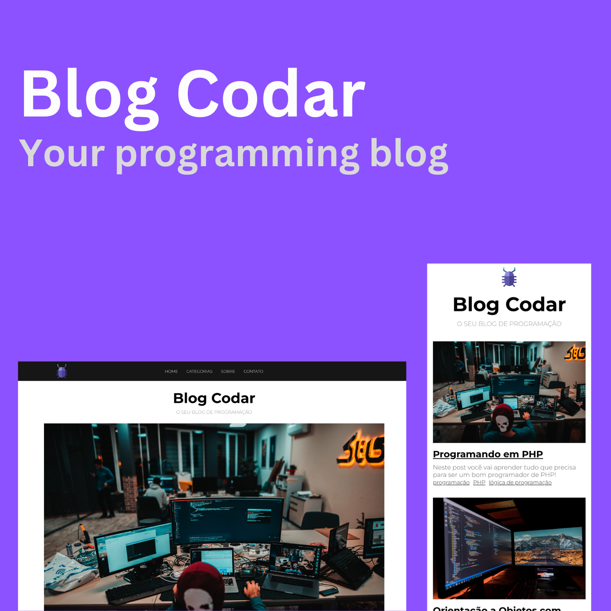

<h1 align="center"> Blog Codar </h1>

  <a href="#-technologies">Technologies</a>&nbsp;&nbsp;&nbsp;|&nbsp;&nbsp;&nbsp;
  <a href="#-project">Project</a>&nbsp;&nbsp;&nbsp;|&nbsp;&nbsp;&nbsp;
  <a href="#memo-license">License</a>

  

 

  

## 🚀 Technologies

This project was developed with the following technologies:

- PHP
- CSS

## 💻 Project

The Blog Codar is a project that informs you of everything you need to know about the latest in programming

## :memo: License

This project is under MIT license. Veja o arquivo [LICENSE](LICENSE.md) para mais detalhes.
